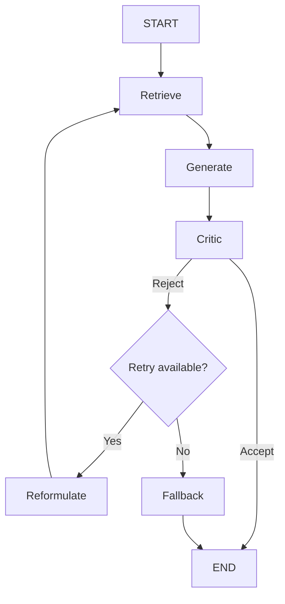

# Self-Healing RAG Pipeline

## 1. Problem Statement
Ordinary Retrieval-Augmented Generation (RAG) pipelines blindly pass retrieved context to an LLM and return the generated answer, assuming the retrieval was successful. This often leads to hallucinations when the context lacks sufficient evidence, as the LLM attempts to answer anyway. This project implements a **Self-Healing RAG pipeline** that verifies its own answers and retries retrieval if the answer is not grounded in the retrieved documents.

## 2. Features
- **RAG**: Combines document retrieval with generative AI.
- **Vector Search**: Uses ChromaDB and embeddings for semantic search.
- **Grounded Generation**: Instructs the LLM to only answer using provided evidence.
- **Critic**: An LLM-as-a-judge node that evaluates whether the generated answer is supported by the context.
- **Query Reformulation**: Modifies the search query to improve retrieval if the original answer is rejected.
- **Retry Loop**: A cyclical workflow that attempts retrieval and generation multiple times.
- **Fallback**: Gracefully admits "I don't have enough information" if retries are exhausted.
- **LangGraph State Machine**: Orchestrates the entire graph, state, and conditional routing.

## 3. Architecture


## 4. Tech Stack
- **Python 3.11+**
- **LangGraph & LangChain**: For orchestration and RAG utilities.
- **Ollama**: Local LLM inference.
- **ChromaDB**: Local vector database.
- **HuggingFace Embeddings**: For creating document vectors.
- **Pydantic**: For structured critic outputs.

## 5. Installation
Clone the repository, create a virtual environment, and install dependencies:
```bash
git clone <your-repo>
cd self-healing-rag
python -m venv .venv
# Activate virtual environment (.venv\Scripts\activate on Windows)
pip install -r requirements.txt
```
Make sure you have [Ollama](https://ollama.com/) installed and running locally with the required model (e.g., `llama3` or `phi3`).
Configure your `.env` file with the correct `MODEL_NAME` and `MAX_RETRIES`.

## 6. Usage
To ingest documents and run the interactive CLI:
```bash
python src/main.py
```
Example interaction:
```
Ask a question: What is the company's remote work policy?
...
Attempt 1
Retrieved: 4 chunks
Critic: REJECT
Reason: The context does not mention remote work...

Reformulated query: "remote work eligibility requirements guidelines"

Attempt 2
Retrieved: 4 chunks
Critic: ACCEPT

FINAL ANSWER:
The remote work policy states that eligible employees may work from home up to 2 days a week...
```

You can also run the evaluation script to compare Normal RAG vs Self-Healing RAG:
```bash
python src/evaluate.py
```

## 7. Workflow Explanation
1. **Retrieve**: Uses ChromaDB to fetch the top-k most relevant document chunks based on the current query.
2. **Generate**: Passes the retrieved context and question to the LLM to generate a draft answer.
3. **Critic**: Evaluates if the draft answer is fully supported by the retrieved context. Returns `accept` or `reject` with a reason.
4. **Reformulate**: If rejected, uses the critic's feedback to rewrite the search query for better retrieval.
5. **Fallback**: If the retry limit is reached, returns a safe "insufficient information" response instead of hallucinating.

## 8. Self-Healing Logic
The retry cycle is the core of the self-healing logic. Instead of regenerating an answer from the *same* bad context, a rejected answer triggers the `reformulate` node. This creates a cycle (`Reformulate → Retrieve → Generate → Critic`) that attempts to find better evidence. This cycle is constrained by a configurable `MAX_RETRIES` (e.g., 2) to prevent infinite loops.

## 9. Testing
The project includes unit tests for the core components:
- `test_graph.py`: Tests the conditional routing logic.
- `test_critic.py`: Tests the critic's ability to accept grounded answers and reject ungrounded ones.
- `test_retrieval.py` & `test_ingestion.py`: Verifies document loading and vector store functionality.

Run the tests using `unittest`:
```bash
python -m unittest discover tests/
```

## 10. Limitations
- **LLM Judge Reliability**: The critic is an LLM itself and can occasionally make mistakes in judging "groundedness".
- **Retrieval Quality**: If the vector database lacks the information entirely, no amount of retries will find it.
- **Latency**: Cyclical retries mean requests can take 2-3x longer if the first attempt is rejected.
- **Local Model Constraints**: Smaller local models might struggle with complex critic instructions compared to larger frontier models.

## 11. Future Improvements
- Add **Reranking** after retrieval for better precision.
- Implement **Hybrid Retrieval** (Semantic + Keyword search).
- Build a web interface (FastAPI + Streamlit).
- Add LangSmith tracing for better observability.
- Support multiple document types (PDFs, Word documents).
